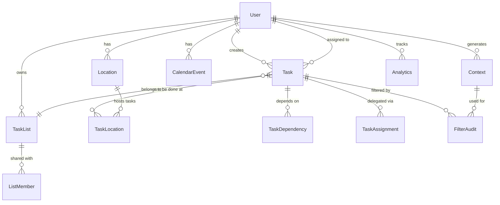

# Data Model: Context-Aware Task Management System

**Date**: 2025-09-08  
**Feature**: Here and Now Task Management  
**Branch**: 001-build-an-application

## Entity Definitions

### User
Represents an individual who creates, owns, or is assigned tasks.

```go
type User struct {
    ID           string    `db:"id" json:"id"`                      // UUID
    Username     string    `db:"username" json:"username"`          // Unique
    Email        string    `db:"email" json:"email"`                // Unique
    PasswordHash string    `db:"password_hash" json:"-"`            // Argon2
    DisplayName  string    `db:"display_name" json:"display_name"`
    TimeZone     string    `db:"timezone" json:"timezone"`          // IANA timezone
    CreatedAt    time.Time `db:"created_at" json:"created_at"`
    UpdatedAt    time.Time `db:"updated_at" json:"updated_at"`
    LastSeenAt   time.Time `db:"last_seen_at" json:"last_seen_at"`
    Settings     JSON      `db:"settings" json:"settings"`          // User preferences
}
```

**Validation Rules**:
- Username: 3-50 characters, alphanumeric + underscore
- Email: Valid email format
- Password: Minimum 8 characters (before hashing)
- TimeZone: Valid IANA timezone string

### Task
Core unit of work to be completed.

```go
type Task struct {
    ID               string          `db:"id" json:"id"`                           // UUID
    Title            string          `db:"title" json:"title"`                     // Required
    Description      string          `db:"description" json:"description"`
    CreatorID        string          `db:"creator_id" json:"creator_id"`           // FK to User
    AssigneeID       *string         `db:"assignee_id" json:"assignee_id"`         // FK to User, nullable
    ListID           *string         `db:"list_id" json:"list_id"`                 // FK to TaskList
    Status           TaskStatus      `db:"status" json:"status"`                   // enum
    Priority         int             `db:"priority" json:"priority"`               // 1-5
    EstimatedMinutes *int            `db:"estimated_minutes" json:"estimated_minutes"`
    DueAt            *time.Time      `db:"due_at" json:"due_at"`
    CompletedAt      *time.Time      `db:"completed_at" json:"completed_at"`
    CreatedAt        time.Time       `db:"created_at" json:"created_at"`
    UpdatedAt        time.Time       `db:"updated_at" json:"updated_at"`
    Metadata         JSON            `db:"metadata" json:"metadata"`               // Flexible fields
    RecurrenceRule   *string         `db:"recurrence_rule" json:"recurrence_rule"` // RFC 5545 RRULE
    ParentTaskID     *string         `db:"parent_task_id" json:"parent_task_id"`   // For subtasks
}

type TaskStatus string
const (
    TaskStatusPending   TaskStatus = "pending"
    TaskStatusActive    TaskStatus = "active"
    TaskStatusCompleted TaskStatus = "completed"
    TaskStatusCancelled TaskStatus = "cancelled"
    TaskStatusBlocked   TaskStatus = "blocked"
)
```

**Validation Rules**:
- Title: 1-500 characters, required
- Priority: Integer 1-5 (1=lowest, 5=highest)
- EstimatedMinutes: Positive integer
- Status transitions: pending→active→completed, any→cancelled

### TaskList
Collection of tasks that can be personal or shared.

```go
type TaskList struct {
    ID          string         `db:"id" json:"id"`                    // UUID
    Name        string         `db:"name" json:"name"`
    Description string         `db:"description" json:"description"`
    OwnerID     string         `db:"owner_id" json:"owner_id"`        // FK to User
    IsShared    bool           `db:"is_shared" json:"is_shared"`
    Color       string         `db:"color" json:"color"`              // Hex color
    Icon        string         `db:"icon" json:"icon"`                // Icon identifier
    ParentID    *string        `db:"parent_id" json:"parent_id"`      // Hierarchical lists
    Position    int            `db:"position" json:"position"`        // Sort order
    CreatedAt   time.Time      `db:"created_at" json:"created_at"`
    UpdatedAt   time.Time      `db:"updated_at" json:"updated_at"`
    Settings    JSON           `db:"settings" json:"settings"`        // List-specific settings
}
```

### Location
Geographic position or named place where tasks can be completed.

```go
type Location struct {
    ID          string     `db:"id" json:"id"`                    // UUID
    UserID      string     `db:"user_id" json:"user_id"`          // FK to User
    Name        string     `db:"name" json:"name"`                // e.g., "Home", "Office"
    Address     string     `db:"address" json:"address"`
    Latitude    float64    `db:"latitude" json:"latitude"`
    Longitude   float64    `db:"longitude" json:"longitude"`
    Radius      int        `db:"radius" json:"radius"`            // Meters
    Category    string     `db:"category" json:"category"`        // home, work, store, etc.
    PlaceID     *string    `db:"place_id" json:"place_id"`        // Google/OSM Place ID
    Metadata    JSON       `db:"metadata" json:"metadata"`        // Hours, contact info, etc.
    CreatedAt   time.Time  `db:"created_at" json:"created_at"`
    UpdatedAt   time.Time  `db:"updated_at" json:"updated_at"`
}
```

### TaskLocation
Many-to-many relationship between tasks and locations.

```go
type TaskLocation struct {
    ID         string    `db:"id" json:"id"`                  // UUID
    TaskID     string    `db:"task_id" json:"task_id"`        // FK to Task
    LocationID string    `db:"location_id" json:"location_id"` // FK to Location
    IsRequired bool      `db:"is_required" json:"is_required"` // Must be at location
    CreatedAt  time.Time `db:"created_at" json:"created_at"`
}
```

### TaskDependency
Relationships between tasks where one must complete before another.

```go
type TaskDependency struct {
    ID               string              `db:"id" json:"id"`                             // UUID
    TaskID           string              `db:"task_id" json:"task_id"`                   // FK to Task
    DependsOnTaskID  string              `db:"depends_on_task_id" json:"depends_on_task_id"` // FK to Task
    DependencyType   DependencyType      `db:"dependency_type" json:"dependency_type"`   // enum
    CreatedAt        time.Time           `db:"created_at" json:"created_at"`
}

type DependencyType string
const (
    DependencyTypeBlocking   DependencyType = "blocking"    // Must complete before
    DependencyTypeRelated    DependencyType = "related"     // Informational
    DependencyTypeScheduled  DependencyType = "scheduled"   // Time-based
)
```

### CalendarEvent
Synchronized calendar events that affect task availability.

```go
type CalendarEvent struct {
    ID           string     `db:"id" json:"id"`                      // UUID
    UserID       string     `db:"user_id" json:"user_id"`            // FK to User
    ProviderID   string     `db:"provider_id" json:"provider_id"`    // google, outlook, etc.
    ExternalID   string     `db:"external_id" json:"external_id"`    // Provider's event ID
    Title        string     `db:"title" json:"title"`
    StartAt      time.Time  `db:"start_at" json:"start_at"`
    EndAt        time.Time  `db:"end_at" json:"end_at"`
    Location     *string    `db:"location" json:"location"`
    IsAllDay     bool       `db:"is_all_day" json:"is_all_day"`
    IsBusy       bool       `db:"is_busy" json:"is_busy"`            // Affects availability
    Metadata     JSON       `db:"metadata" json:"metadata"`
    LastSyncedAt time.Time  `db:"last_synced_at" json:"last_synced_at"`
}
```

### Context
Current state snapshot used for filtering decisions.

```go
type Context struct {
    ID                string     `db:"id" json:"id"`                               // UUID
    UserID            string     `db:"user_id" json:"user_id"`                     // FK to User
    Timestamp         time.Time  `db:"timestamp" json:"timestamp"`
    CurrentLatitude   *float64   `db:"current_latitude" json:"current_latitude"`
    CurrentLongitude  *float64   `db:"current_longitude" json:"current_longitude"`
    CurrentLocationID *string    `db:"current_location_id" json:"current_location_id"` // FK to Location
    AvailableMinutes  int        `db:"available_minutes" json:"available_minutes"`     // Until next event
    SocialContext     string     `db:"social_context" json:"social_context"`           // alone, with_family, etc.
    EnergyLevel       int        `db:"energy_level" json:"energy_level"`               // 1-5
    WeatherCondition  *string    `db:"weather_condition" json:"weather_condition"`
    TrafficLevel      *string    `db:"traffic_level" json:"traffic_level"`
    Metadata          JSON       `db:"metadata" json:"metadata"`
}
```

### ListMember
Users who have access to shared lists.

```go
type ListMember struct {
    ID         string         `db:"id" json:"id"`                  // UUID
    ListID     string         `db:"list_id" json:"list_id"`        // FK to TaskList
    UserID     string         `db:"user_id" json:"user_id"`        // FK to User
    Role       MemberRole     `db:"role" json:"role"`              // enum
    InvitedBy  string         `db:"invited_by" json:"invited_by"`  // FK to User
    InvitedAt  time.Time      `db:"invited_at" json:"invited_at"`
    AcceptedAt *time.Time     `db:"accepted_at" json:"accepted_at"`
}

type MemberRole string
const (
    MemberRoleOwner  MemberRole = "owner"
    MemberRoleEditor MemberRole = "editor"
    MemberRoleViewer MemberRole = "viewer"
)
```

### TaskAssignment
Track task delegation and handoffs.

```go
type TaskAssignment struct {
    ID              string          `db:"id" json:"id"`                          // UUID
    TaskID          string          `db:"task_id" json:"task_id"`                // FK to Task
    AssignedBy      string          `db:"assigned_by" json:"assigned_by"`        // FK to User
    AssignedTo      string          `db:"assigned_to" json:"assigned_to"`        // FK to User
    AssignedAt      time.Time       `db:"assigned_at" json:"assigned_at"`
    Status          AssignmentStatus `db:"status" json:"status"`                 // enum
    ResponseAt      *time.Time      `db:"response_at" json:"response_at"`
    ResponseMessage *string         `db:"response_message" json:"response_message"`
}

type AssignmentStatus string
const (
    AssignmentStatusPending  AssignmentStatus = "pending"
    AssignmentStatusAccepted AssignmentStatus = "accepted"
    AssignmentStatusRejected AssignmentStatus = "rejected"
)
```

### FilterAudit
Track why tasks were shown/hidden for transparency.

```go
type FilterAudit struct {
    ID             string     `db:"id" json:"id"`                         // UUID
    UserID         string     `db:"user_id" json:"user_id"`               // FK to User
    TaskID         string     `db:"task_id" json:"task_id"`               // FK to Task
    ContextID      string     `db:"context_id" json:"context_id"`         // FK to Context
    IsVisible      bool       `db:"is_visible" json:"is_visible"`
    Reasons        JSON       `db:"reasons" json:"reasons"`               // Array of rule applications
    PriorityScore  float64    `db:"priority_score" json:"priority_score"`
    CreatedAt      time.Time  `db:"created_at" json:"created_at"`
}
```

### Analytics
Aggregate metrics for productivity tracking.

```go
type Analytics struct {
    ID               string     `db:"id" json:"id"`                             // UUID
    UserID           string     `db:"user_id" json:"user_id"`                   // FK to User
    Date             time.Time  `db:"date" json:"date"`                         // Day for aggregation
    TasksCreated     int        `db:"tasks_created" json:"tasks_created"`
    TasksCompleted   int        `db:"tasks_completed" json:"tasks_completed"`
    TasksCancelled   int        `db:"tasks_cancelled" json:"tasks_cancelled"`
    MinutesEstimated int        `db:"minutes_estimated" json:"minutes_estimated"`
    MinutesActual    int        `db:"minutes_actual" json:"minutes_actual"`
    LocationChanges  int        `db:"location_changes" json:"location_changes"`
    Metadata         JSON       `db:"metadata" json:"metadata"`                 // Additional metrics
}
```

## Relationships



## State Transitions

### Task Status Flow
```
pending → active → completed
   ↓        ↓         ↑
   ↓     blocked ←────┘
   ↓        ↓
   └──→ cancelled
```

### Assignment Status Flow
```
pending → accepted
   ↓
rejected → (returns to owner)
```

## Indexes

### Performance Indexes
- `users_username_unique`: UNIQUE(username)
- `users_email_unique`: UNIQUE(email)
- `tasks_assignee_status`: INDEX(assignee_id, status)
- `tasks_list_status`: INDEX(list_id, status)
- `tasks_due_at`: INDEX(due_at)
- `task_locations_task`: INDEX(task_id)
- `task_locations_location`: INDEX(location_id)
- `calendar_events_user_time`: INDEX(user_id, start_at, end_at)
- `contexts_user_timestamp`: INDEX(user_id, timestamp)
- `filter_audit_user_task`: INDEX(user_id, task_id, created_at)

### Full-Text Search
- `tasks_fts`: FTS5(title, description)
- `locations_fts`: FTS5(name, address)

## Data Integrity Constraints

### Foreign Keys
- All foreign key relationships enforced at database level
- CASCADE DELETE for dependent records (audit logs, contexts)
- RESTRICT DELETE for referenced entities (users, tasks)

### Check Constraints
- `tasks_priority_check`: priority BETWEEN 1 AND 5
- `tasks_estimated_positive`: estimated_minutes > 0
- `locations_radius_positive`: radius > 0
- `contexts_energy_check`: energy_level BETWEEN 1 AND 5

### Unique Constraints
- `task_dependencies_unique`: UNIQUE(task_id, depends_on_task_id)
- `task_locations_unique`: UNIQUE(task_id, location_id)
- `list_members_unique`: UNIQUE(list_id, user_id)

## Migration Strategy

### Version 1.0.0 (Initial Schema)
All tables created with initial indexes and constraints.

### Future Considerations
- Partitioning for analytics table by date
- Archival strategy for completed tasks > 1 year
- Index optimization based on query patterns
- Potential denormalization for read performance

---
*Data model defined per Implementation Plan Phase 1 requirements*